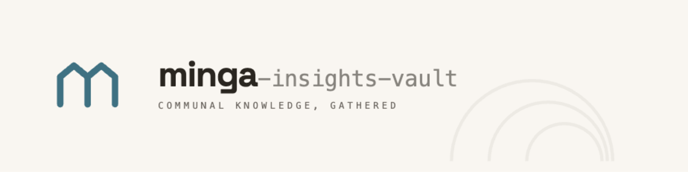

<!-- Banner auto-swaps with the viewer's GitHub light/dark theme -->
<p align="center">
  <picture>
    <source media="(prefers-color-scheme: dark)" srcset=".github/assets/minga-banner-dark.png">
    
  </picture>
</p>

<p align="center">
  <em>Communal knowledge, gathered.</em>
</p>

<p align="center">
  <a href="https://github.com/dcatalanmolina/minga-insights-vault/releases"></a>
  <a href="https://github.com/dcatalanmolina/minga-insights-vault/blob/main/LICENSE"></a>
  <a href="https://github.com/dcatalanmolina/minga-insights-vault/stargazers"></a>
  <a href="https://github.com/dcatalanmolina/minga-insights-vault/issues"></a>
</p>

---

`minga-insights-vault` is an open-source vault to gather insights, influence decisions, and track strategy, powered by collaboration-first agents. It's built on three pillars:

- **Free, open-source tooling for small teams.** No paid platform required — Obsidian, a handful of community plugins, and your AI harness of choice.
- **Collaboration over automation.** Agents ask questions and name gaps instead of writing your insights for you. See the [`peer-reviewer` → `reviewer-2` pipeline](#agents--skills) for what that looks like in practice.
- **Portable Agent Skills.** The folder structure and conventions are harness-agnostic — use Claude Code, Codex, etc. — and follow the [Agent Skill standard](https://agentskills.io/home).

See the [Releases page](https://github.com/dcatalanmolina/minga-insights-vault/releases) for what's new.

Get started by firing up your harness and giving it this instruction:

```
Review the AGENTS.md file and invoke minga-host to help me get started
```

## Agents & Skills

Five collaboration-first agents ship with this repo. Each has a defined role, a set of skills, and clear constraints on what it will and won't do — the full catalog lives in [`AGENTS.md`](AGENTS.md).

| Agent | Does | Invoke when |
|---|---|---|
| `minga-host` | Helps you understand and use the repo | You're learning how to use the vault |
| `minga-pm` | Files bugs, scopes features, manages the backlog via GitHub Issues | You want to file a bug, scope a feature, or review the backlog |
| `peer-reviewer` | Asks questions and names gaps while you form an insight — doesn't write it for you | You're drafting an insight or want a structured review of one |
| `reviewer-2` | Runs Chain of Verification on a finished insight, annotating evidence gaps inline | An insight is complete and its evidence needs stress-testing |
| `workflow-mapper` | Frames a business process using BPMN, then turns it into a canvas diagram | You want to learn BPMN or map a workflow |

The `peer-reviewer` → `reviewer-2` pipeline is the clearest embodiment of the "collaborate, don't automate" pillar: `peer-reviewer` brings drafting rigor through Socratic questioning, then `reviewer-2` follows up with evidence verification, surfacing gaps as inline `COV: PASS/GAP` annotations. See a full transcript in [Working with Subagents](docs/working-with-subagents.md).

Eleven skills back these agents — see the [Skill Catalog in `AGENTS.md`](AGENTS.md#skill-catalog) for the complete list.

## What minga helps you do

Every project gets a home in `Projects`, linking its data, insights, and decisions in one place. From there, minga helps with:

- **Capture what customers actually said, not your summary of it.** Drop transcripts, meeting notes, and other raw sources into `Data`, so the original quote is always one click away from any theme you name.
- **Turn scattered notes into named, reusable themes.** Highlight and code text with Quadro's side panel — it's organized into `Codes` automatically — so you can spot a pattern across ten sources instead of re-reading all ten every time.
- **Get from a hunch to a defensible insight.** Take analysis notes in `Analysis` as themes emerge, then draft a full insight — with `peer-reviewer` questioning your framing and `reviewer-2` running Chain of Verification on the evidence — so what reaches a decision-maker can survive scrutiny.
- **Put insights in front of the team, not stuck in a doc.** Organize them on a canvas in `Global Notes`, so you're facilitating a discussion instead of emailing a report nobody opens.
- **Make the line from evidence to action traceable.** Record the decisions an insight supports in `Decisions` (`DCN-####`, Strategy Canvas), so anyone can trace *why* a call was made back to the research behind it.
- **Agree on how a process actually works before redesigning it.** Map it as a `WKF-####.canvas` diagram in `Workflows` with `workflow-mapper` — as a record of today's process or a proposal for tomorrow's — so you and stakeholders start from the same picture.

**New here?** Follow the [Getting Started](docs/getting-started.md) walkthrough for a step-by-step example.

**Learn more:**
- [Conventions](docs/conventions.md) — file naming and structure conventions
- [Working with Subagents](docs/working-with-subagents.md) — a full `peer-reviewer` session transcript
- [Workflow Mapping](docs/workflow-mapping.md) — how to frame a process with BPMN and the `workflow-mapper` agent
- [Adopting This Repo for Your Team](docs/adopting-for-your-team.md) — get a private copy, share it with a GitHub Team, and pull in future releases
- [Inspiration & Acknowledgments](docs/inspiration.md) — the frameworks, tools, and prior art this project builds on

## About the name

A *minga* is a tradition of communal labor and reciprocity from rural southern Chile — neighbors coming together to raise a house or bring in a harvest, work shared and given back in turn. This project is a vault built the same way: knowledge gathered by many hands.

## Contributing

Contributions are welcome — in the spirit of the minga. See [CONTRIBUTING.md](CONTRIBUTING.md) to get started.
- If you have an idea for a collaboration-first agent, but don't know how to implement it, add a new issue describing its goals, principles, and skills. We can build it together.

- If you find bugs or gaps in the file system or agent layer, add a new issue describing what doesn't work for you, why, and in what situation. The more gaps people report, the easier it will be to build something that scales.

- If you want to contribute as an active developer building new features, let me know!

## License

MIT